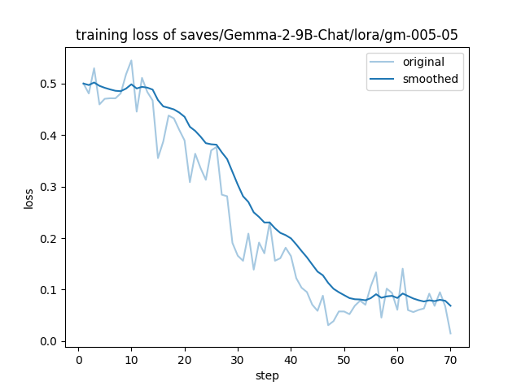

# Neoheartbeats Kernel

## Current progress

sthenno-gm-04 is a fine-tuned version of DeepMind's gemma2-9b-it.

This model is optimized by KTO(Kahneman-Tversky Optimization) using custom data.

This model is designed to output more naturally that to align human's preferences,
but NOT including to instruct the model to generate human-like outputs such as emotions.

One part of this design is to discover how LLMs implement mental models for
continual-learning and long-term memory's constructions.

Model's safetensors and training data have NOT been disclosed yet but planned to be by
publishing to platforms such as HuggingFace once reliable data is collected under
replicated evaluations.

### Training Arguments

- Training device: NVIDIA A40
- Memory usage: up to 44GB
- Framework used: [LLaMA-Factory](https://github.com/hiyouga/LLaMA-Factory)
- Base model: [google/gemma-2-9b-it](https://huggingface.co/google/gemma-2-9b-it)

```yaml
bf16: true
cutoff_len: 2048
dataset: kto-02
dataset_dir: data
ddp_timeout: 180000000
do_train: true
finetuning_type: lora
gradient_accumulation_steps: 16
include_num_input_tokens_seen: true
learning_rate: 5.0e-05
lora_alpha: 32
lora_dropout: 0
lora_rank: 16
lora_target: all
lr_scheduler_type: cosine
max_grad_norm: 1.0
max_samples: 3000
model_name_or_path: /home/neoheartbeats/endpoint/models/gm2-9b-it
num_train_epochs: 60.0
optim: adamw_torch
output_dir: saves/Gemma-2-9B-Chat/lora/gm-002-03
packing: false
per_device_train_batch_size: 4
plot_loss: true
pref_beta: 0.05
pref_ftx: 0
pref_loss: kto_pair
stage: kto
template: gemma
```



## Roadmap
### 01 Optimize CUDA kernels

- https://docs.nvidia.com/datacenter/cloud-native/container-toolkit/latest/release-notes.html

- https://catalog.ngc.nvidia.com/orgs/nvidia/containers/cuda

- https://docs.nvidia.com/datacenter/cloud-native/container-toolkit/latest/sample-workload.html

- https://docs.docker.com/config/containers/resource_constraints/

- https://www.supermicro.com/en/support/resources/downloadcenter/smsdownload?category=SUM

- https://docs.portainer.io/v/2.20/start/upgrade/docker

---

现在第一步任务是部署一个服务端的向量数据库 (当前选择 Qdrant),
使用 CUDA 开发版 (并非企业部署), 在 Docker 和 Conda 环境下启用.
最优化 CUDA 目前需要配置系统的 grub, 但远程环境不能直接进 BIOS,
所以目前在配置 Supermicro 的 SUM/BMC, 当作服务器硬件监控使用.

---

### 02 Enable Docker containers

This is specifically for deployment of Qdrant.

### 03 Python scripts

- Transformers/Unsloth for model training
- Optimizing LLM using RAG and continuing data-generating using algorithms like DPO and
alternatives like KTO

---

## Appendix：Hardware limiting

- NVIDIA A40 48GB (training and inferences)
- Apple M3 MAX 48GB (inferences)
